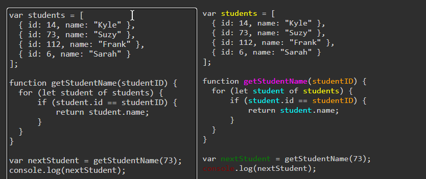

# JavaScript Scope Syntax Highlighting

## A syntax highlighter that also colors variable by scope



Inspired by Douglas Crockford's ['Monads and Gonads'
 ](https://www.youtube.com/watch?v=b0EF0VTs9Dc&t=899s) talk and [Context Coloring](https://daniellamb.com/JavaScript-Scope-Context-Coloring/example/scope-coloring.html).

Usage
```sh
git clone https://github.com/NoamRa/js-scope-syntax-highlighting.git
cd js-scope-syntax-highlighting
npm install
npm start
```

No live demo... yet 🤞